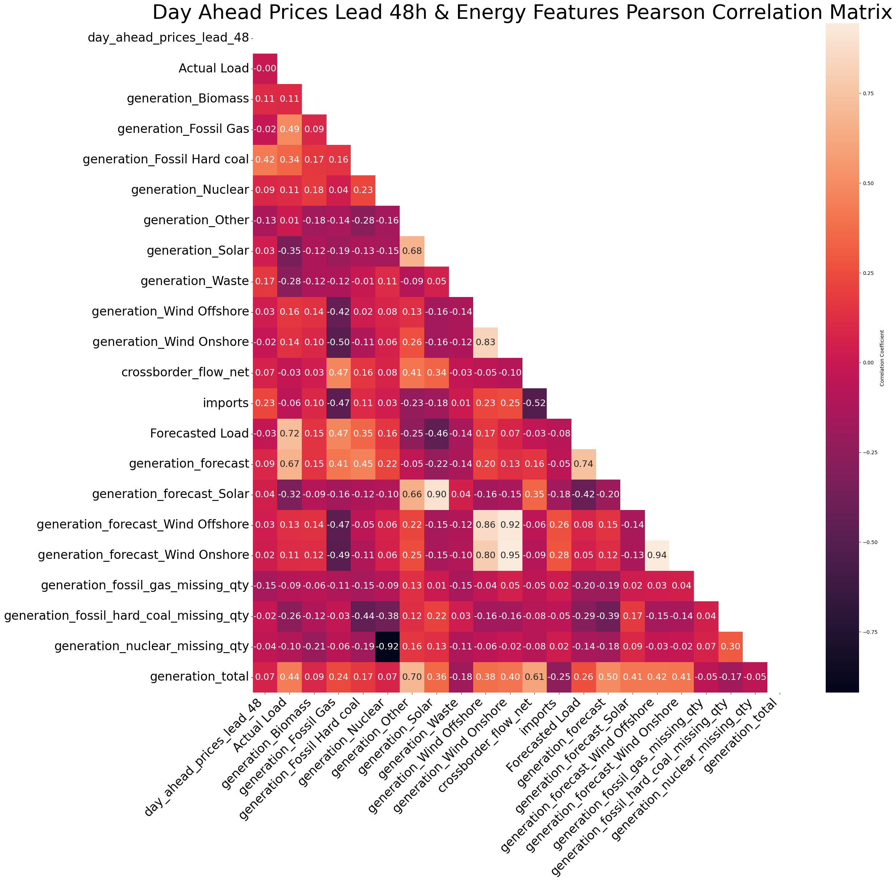

# Netherlands Electricity Price Prediction

## Motivation

European energy prices became a critical issue following their sharp increase in 2022. During this period, energy and supply costs surged by 110% compared to 2020 (Smal and Wieprow, 2023), forcing governments across the region to implement stimulus packages to avert a cost of living crisis. Although prices started to decline in 2023, the high inflation economic environment continues to pose a significant challenge for households.

Given the increased sensitivity to energy expenditure, there is a pressing need for households to have access to accurate energy price forecasts. These forecasts can help optimise energy consumption, potentially leading to substantial cost savings. Accurate predictions can enable consumers to make informed decisions about when to use energy-intensive appliances, thus reducing their overall expenditure.

The goal of this project is to develop a model that generates precise day-ahead energy price forecasts. By providing these forecasts through a user-friendly dashboard application, I aim to empower households to optimise their energy usage and mitigate the financial burden of fluctuating energy prices.

As a case study to demonstrate the model's accuracy, I generate forecasts for day-ahead electricity prices in the Netherlands and compare the results of the proposed method against benchmarks found in the literature. 

## Literature Review

### Qualitative Drivers of European Energy Prices (2021-2023)

From a qualitative perspective, numerous factors influenced European energy prices between 2021 and 2023. Key reasons for price increases in 2021 and 2022, as outlined by Alvarez and Molnar (2021) and Bolton (2022), include:

1. COVID-19 Pandemic:
    1. The pandemic led to a significant decline in energy demand, which resulted in reduced energy supply.
    2. During the post-pandemic economic recovery, energy demand rebounded rapidly, outpacing the slower increase in supply.
2. Increases in Natural Gas and Coal Prices:
    1. Reduced gas supply from Russia following the conflict with Ukraine and supply-side constraints limited gas imports, driving up prices.
3. Unfavourable Weather Conditions:
    1. A long, cold winter in 2021 diminished gas reserves.
    2. Heatwaves in the summer of 2022 affected hydroelectric and nuclear power generation, increasing reliance on gas for electricity.
    3. Lower-than-expected wind generation in 2022 further strained the energy supply.

Energy prices started returning closer to historical levels in 2023 and 2024. Factors influencing this reversal, as discussed by Tertre, Martinez, and Rábago (2023) and Power Engineering International (2023), include:

1. Declining Natural Gas Prices:
    1. Diversification of energy sources led to a decrease in natural gas demand.
    2. The EU reduced its dependency on Russian natural gas from over 40% to below 10% in 2023.
    3. Natural gas storage levels were built up to historic highs.
    4. Historically low energy demand in 2023 followed the previous years' price surges.
2. Increased Renewable Energy Production:
    1. Improved nuclear availability in France.
    2. High renewable generation led to negative day-ahead prices.
 
### Electricity Price Forecasting Literature 

The volatile nature of electricity prices has made their modelling a core research area in the energy sector. The literature extensively documents factors influencing electricity prices, commonly including:

1. Historical electricity prices.
2. Historical grid load.
3. Historical generation capacity.
4. Historical residual demand.
5. Historical fuel prices.
6. Day-ahead grid load forecasts.
7. Day-ahead generation capacity.
8. Temporal and calendar features: hour of day, day of week, month of year, holidays.
9. Weather features: temperature, wind speed, precipitation, etc.

In terms of methods, deep learning and machine learning are prominent for modelling short-term electricity prices. Lago, De Ridder, and De Schutter (2018) benchmarked 98 different models for forecasting spot electricity prices, showing that deep learning models, specifically deep neural networks, perform best overall. Machine learning-based methods generally outperform statistical methods. Similarly, studies by Keles, Scelle, Paraschiv, and Fichtner (2016) and Lago, Marcjasz, De Schutter, and Weron (2021) benchmarked various models for forecasting day-ahead electricity prices. Both studies concluded that deep learning models offer superior performance, though Lago et al. (2021) also highlighted the benefits of linear methods, such as competitive performance, lower computational requirements, and faster forecast generation.

Lago, De Ridder, Vrancx, and De Schutter (2018) investigated the effect of incorporating cross-market data from Belgium and France to forecast electricity prices for Belgium. They demonstrated that including French market data improved the accuracy of forecasting Belgium's electricity prices. Furthermore, they found that a dual-market forecasting model, which integrates data from both Belgium and France, can enhance predictive accuracy. This finding suggests that the features listed above should not only include local market data but also relevant data from neighbouring markets to achieve better forecasting performance.

## Data

### Data Description

The following features were selected for modelling day-ahead electricity prices in the Netherlands, based on their recognition in the literature as meaningful explanatory variables:

**Energy Features:**
1. Day-ahead prices
2. Total load and day-ahead total load forecasts
3. Aggregated generation per type and the day-ahead forecast of the total aggregated generation
4. Unavailability of generation units
5. Day-ahead forecast of wind
6. Net physical cross-border flows
7. Total physical cross-border imports
8. Day-ahead generation forecasts for wind and solar

**Weather Features:**
1. Temperature
2. Wind speed
3. Pressure
4. Dew point
5. Humidity

**Calendar Features:**
1. Dutch holidays

Energy data was obtained from the ENTSO-E transparency platform, and comprehensive details of data items can be found in the “Detailed Data Descriptions” document by ENTSO-E (2022). Weather data were sourced from OpenWeatherMap, and Dutch holidays were retrieved using the Python package ‘holidays’.

Fuel prices, natural gas in particular, were identified as being valuable covariates for modelling electricity prices, however, such data was not freely available. A point for future work would be to include such features.

### Data Processing

    
    
<strong>Figure 1:</strong> Netherlands Day Ahead Electricity Prices 2020 - 2023.

The data preprocessing involved several key steps to prepare the dataset for modelling:

**Data Cleaning**\
The data was initially cleaned by resampling to an hourly frequency where necessary, removing duplicate entries, and eliminating features with a majority of null or zero values. Outliers were identified and removed, and missing values were interpolated to ensure a complete dataset.

**Weather Data Aggregation**\
Weather data was obtained for seven Dutch cities: Almer, Amsterdam, Eindhoven, Groningen, Rotterdam, The Hague, and Utrecht. Naturally, weather data from these cities were highly correlated. To address this, correlated features were aggregated into single weighted features using electricity consumption as weights, as retrieved from Basanisi (2020).

**Price Transformation**\
Common processing steps in forecasting financial prices, such as converting raw prices into returns and applying a log-transformation, were not used here due to the potential for zero and negative electricity prices. Although the Box-Cox transformation can handle negative values, it was not investigated in this study but could be a point for future work.

**Feature Engineering**\
Additional features were generated to better describe the target variable. Both the literature and figures 2 and 3 demonstrate hour-of-day and day-of-week seasonality, so these variables were included. Lagged features were also added to give the model more context. Optimal lags were selected by calculating the mutual information between lagged variables and the target variable, generally finding that variables lagged by one week added the most information. To provide information about the relative degree of the current time residual load compared to the residual load of the past hours, a relative load indicator (RLI) was calculated for lags of 24, 48, and 168 hours (Keles, Scelle, Paraschiv, Fichtner, 2016).

    
    
<strong>Figure 2:</strong> Netherlands Day Ahead Electricity by Year and Month.

    
    
<strong>Figure 3:</strong> Netherlands Day Ahead Electricity Prices by Year and Day of Week.

    
    
<strong>Figure 4:</strong> Netherlands Day Ahead Electricity Prices by Year and Hour of Day.

**Dummy Variables for Holidays**\

Dummy variables for Dutch public holidays were explored. To confirm significant differences in energy prices on holidays versus non-holidays, an A/B test was performed. The variance in electricity prices was very high from 2020-2024, which could actually be the cause for significant differences, not the holiday which is the effect being measured. To confirm that the significant differences were indeed due to the effect of the holiday, a second analysis was performed using data from 2016-2019. This secondary analysis confirmed the initial results. Consequently, dummy variables were included for all holidays except Koningsdag and Bevrijdingsdag, the latter being a public holiday only once every five years.

    
    
<strong>Table 1:</strong> Netherlands Holiday A/B Test 2020 - 2023.

    
    
<strong>Table 2:</strong> Netherlands Holiday A/B Test Prices 2020 - 2024.

**Data Splitting**\
The dataset was divided into training, validation, and testing sets as follows:

1. Training set: 2020-01-06 to 2022-07-07
2. Validation set: 2022-07-08 to 2023-05-11
3. Test set: 2023-05-19 to 2024-03-21

### Data Analysis

To test whether the time series are stationary, an augmented Dickey-Fuller test was performed. Most time series, except for some of the `clouds_all` features, rejected the null hypothesis of non-stationarity.

 

    
    
<strong>Figure 5:</strong> Autocorrelation Function (ACF) and Partial Autocorrelation Function (PACF) plots for Netherlands Day Ahead Electricity Prices.

 

Autocorrelation Function (ACF) and Partial Autocorrelation Function (PACF) plots of the electricity prices are shown in Figure 5. The PACF plot indicates that lags in multiples of 24 are significant, demonstrating hour-of-day seasonality. This suggests that lagged price features are likely to be informative.

 

    
    
<strong>Figure 6:</strong> Day Ahead Prices and Energy Features Pearson Correlation Matrix.

    
    
<strong>Figure 8:</strong> Day Ahead Prices and Weather Features Pearson Correlation Matrix.

 

Day-ahead prices are released for the next day at 12:00 UTC. To have one full day of prices before the actual values are released, prices need to be forecasted 48 hours in advance. This is reflected in the data by generating a new leading variable `day_ahead_prices_lead_48`.

Pearson Correlation Matrices for Day Ahead Prices lead 48h with Energy Features and Weather Features are shown in Figures 6 and 7, respectively. Features with the highest absolute correlation include `generation_Fossil Hard coal` (0.42), `clouds_all_amsterdam` (-0.27), `wind_speed_weighted` (0.25), and `imports` (0.23).

## Methodology

**Model Selection**

As previously mentioned in the literature review, deep neural networks (DNNs) are prominent for modelling short-term electricity prices. However, these methods have some drawbacks: they take a long time to fit, they are prone to overfitting, and they are often uninterpretable.

The first drawback was a particular concern for this work, as the decision was made to forecast the target variable using a rolling method where one day's worth of price data would be forecast using the most recent data available. Using a DNN in this way would not have been viable, as it would have required over 300 separate models to be trained and tuned, which would have taken too much time with the resources available. Additionally, due to the relatively low volume of data available, there was a concern that deep learning methods would overfit. Finally, interpretability was valued in this work to identify specific drivers of day-ahead electricity prices.

Taking these concerns into account, it was decided to use generalised additive models (GAMs) and gradient boosting decision trees (GBDTs), specifically the pyGAM (Servén and Brummitt 2018) and LightGBM (Shi et al. 2024) implementations.

GAM (Hastie and Tibshirani, 1986) is an additive modelling technique where the impact of individual predictive variables is captured through smooth functions, which can be nonlinear (Larsen, 2015). This gives GAM more flexibility and predictive power than linear models, while retaining high interpretability through the individual relationships between predictors and the dependent variable.

GBDTs (Friedman, 2001) are among the most popular machine learning algorithms for tabular data. Several effective implementations exist, such as XGBoost and pGBRT, but their efficiency and scalability are unsatisfactory when the feature dimension is high and data size is large. LightGBM was developed to address these issues, with its creators reporting that LightGBM speeds up the training process of conventional GBDT by over 20 times while achieving almost the same accuracy (Shi et al. 2024).

The results of the pyGAM and LightGBM models are compared to several benchmarks: two naive forecasts, one seasonal ARIMA model, and three regularised linear models (lasso, ridge, and elastic net). The naive approaches predict the price observed in the corresponding hour 48 hours before (1) or one week before (2).

**Hyperparameter Optimization**

Median absolute error was chosen to compare model performance, as this metric is less sensitive to outliers compared to mean squared error. Hyperparameter Optimisation for the benchmark models was straightforward as both ARIMA and regularised linear models have a limited set of parameters and hyperparameters respectively. Parameter choices for ARIMA were confirmed using the pmdarima.auto_arima function.

In most machine learning problems, having more training data is generally preferred, as it allows for more complicated models to be fitted without overfitting. This is not always the case in time series problems, as more recent data can be more valuable for predicting future values. With this in mind, the length of training data was treated as a parameter. Length of training data and regularisation hyperparameters for linear models were optimised by grid search.

For both PyGAM and LightGBM, separate models were fit for various lengths of training data. In the case of PyGAM, insignificant features indicated by the p-values reported in the model summary were removed and regularisation penalties were optimised using grid search. In the case of LightGBM, noise parameters were added to the predictor variables and features with importances less than these values were removed. With the large number of hyperparameters to tune with LightGBM, the Bayesian optimisation package Hyperopt (Bergstra et al., 2013) was used to find optimal values.

Model performance during hyperparameter optimisation was tracked and compared using MLflow, an open-source platform for managing the machine learning lifecycle. MLflow stored experiment data, facilitating the easy comparison of different models and hyperparameter configurations.

## Results

    
    
<strong>Figure 9:</strong> Performance Comparison between Fitted Models.

The results of the pyGAM and LightGBM models are compared to several benchmarks: two naive forecasts, one seasonal ARIMA model, and three regularised linear models (lasso, ridge, and elastic net). The naive approaches predict the price observed in the corresponding hour 48 hours before (naive_minus_2_days) or one week before (naive_minus_7_days).

The naive models were able to describe a considerable amount of variation in the training and validation data, with the naive_minus_2_days and naive_minus_7_days models producing \( R^2 \) values of 0.62 and 0.57, respectively. This indicates strong seasonality in the data during this period. However, the seasonal feature of the data is weaker in the test data, as the \( R^2 \) values considerably worsened to -0.11 and 0.05 for the naive_minus_2_days and naive_minus_7_days models, respectively. The test MAE values for these models are lower compared to the validation MAE values, with test MAE of 29.73 and 27.94 vs. validation MAE of 60.47 and 68.53 for naive_minus_2_days and naive_minus_7_days, respectively. This suggests that day-ahead prices were more volatile during the validation period compared to the test period.

The linear models improved on the naive models, with Lasso producing the lowest test MAE of 22.91 and \( R^2 \) of 0.41. It is notable that the \( R^2 \) value for the Lasso model significantly decreased between the validation and test sets, from 0.69 to 0.41. While the lower training MAE compared to the validation MAE for Lasso suggests potential overfitting, this likely reflects a difference in price volatility between the periods, as also observed for the naive models. Despite the worsening MAE between the training and validation sets, the consistent \( R^2 \) values suggest the model did not overfit. This, along with observations from the naive results, indicates that prices during the testing period were less predictable than during the validation period.

LightGBM produced the best test results among all models examined. However, the test performance was muted compared to its validation performance. LightGBM's validation MAE of 41.36 was a 27% improvement over the next best linear model (57.09 for ridge), while its test MAE of 21.47 was only a 6% improvement over the next best linear model (22.91 for lasso). Similarly, LightGBM's validation \( R^2 \) of 0.83 was significantly higher than the next best linear model (0.72 for ridge), whereas its test \( R^2 \) of 0.44 was only marginally higher than the next best linear model (0.41 for lasso).

These results highlight the challenges of modelling day-ahead electricity prices, particularly the differences in predictability between validation and test periods. The strong seasonality and volatility in the data impact model performance, with LightGBM showing the best overall results but still facing limitations in generalising to unseen data. Future work could explore more sophisticated techniques for handling seasonality and volatility to further improve predictive accuracy.

## System Design 

The goal of this project was to develop a model that generates precise day-ahead energy price forecasts and to serve these forecasts to users through a user-friendly dashboard application. To achieve this, the project was divided into two main components: the frontend and the backend.

For the frontend, [Streamlit](https://streamlit.io/) was chosen due to its simplicity and rapid development capabilities. This web-based interface allows users to input parameters and view forecasts seamlessly. On the backend, FastAPI (Ramírez) was selected for its high performance and ease of integration with machine learning models, enabling efficient processing of requests and model predictions.

Given the prototype nature of the project, a sophisticated method for data storage and retrieval was not implemented. Instead, predictions were generated offline and included as a pandas DataFrame within the Docker container. This approach ensured that all necessary prediction data was readily available for the frontend to access and display, maintaining simplicity while providing the required functionality. Although straightforward, this data handling method was effective for the prototype stage, ensuring that the necessary data was always available for the application to function correctly.

Both the frontend and backend were containerised using Docker to ensure consistency and ease of deployment. The prototype application was deployed to [DigitalOcean](https://www.digitalocean.com/), a cloud platform that offers scalable and reliable infrastructure.

While user authentication and security were not a primary focus for this prototype, the core functionality of the forecasting model and user interface was successfully demonstrated. The system was designed to highlight the practical application of day-ahead energy price forecasting, showcasing both the technical and user interaction aspects of the project.

## Conclusion

The aim of this project was to develop a model that generates precise day-ahead energy price forecasts to enable households to optimise their energy usage. As a case study to demonstrate the model's accuracy, forecasts were generated for day-ahead electricity prices in the Netherlands. Data was retrieved from the ENTSO-E transparency platform and extensively cleaned and preprocessed for modelling. Feature engineering was performed, motivated by the energy price forecasting literature, and a LightGBM model was developed that produced better predictive performance compared to benchmarks found in the literature. These forecasts were visualised in a user-friendly dashboard application, which was deployed using Docker and hosted on DigitalOcean.

Future work could focus on incorporating additional covariates such as fuel prices, especially natural gas, which were identified as valuable for modelling electricity prices but were not included due to data availability constraints. Additionally, the results highlight the challenges posed by temporal variability in seasonality and volatility when modelling day-ahead electricity prices. Future research could explore more sophisticated techniques for handling these factors to further improve predictive accuracy.

## References

Alvarez, C.F. and Molnar, G., 2021. What is behind soaring energy prices and what happens next?.

Basanisi, L. (2020, June). Energy consumption of the Netherlands. Retrieved March 29, 2024 from https://www.kaggle.com/datasets/lucabasa/dutch-energy.

Bergstra, J., Yamins, D., Cox, D. D. (2013) Making a Science of Model Search: Hyperparameter Optimization in Hundreds of Dimensions for Vision Architectures. TProc. of the 30th International Conference on Machine Learning (ICML 2013), June 2013, pp. I-115 to I-23.

Bolton, R., 2022. Natural gas, rising prices and the electricity market.

ENTSO-E. Detailed Data Descriptions, Version 3, Release 3; 2022. Available at: ENTSO-E Detailed Data Descriptions (Accessed: March 25, 2024).

ENTSO-E transparency platform. Available at: ENTSO-E Transparency (Accessed: March 25, 2024).

Friedman, J.H., 2001. Greedy function approximation: a gradient boosting machine. Annals of statistics, pp.1189-1232.

Hastie, T. & Tibshirani, R. (1986), 'Generalized Additive Models', Statist. Sci. 1 (3), 297--310.

holidays 0.50. Available at: https://pypi.org/project/holidays/ (Accessed: March 29, 2024).

Keles, D., Scelle, J., Paraschiv, F. and Fichtner, W., 2016. Extended forecast methods for day-ahead electricity spot prices applying artificial neural networks. Applied energy, 162, pp.218-230.

Lago, J., De Ridder, F. and De Schutter, B., 2018. Forecasting spot electricity prices: Deep learning approaches and empirical comparison of traditional algorithms. Applied Energy, 221, pp.386-405.

Lago, J., De Ridder, F., Vrancx, P. and De Schutter, B., 2018. Forecasting day-ahead electricity prices in Europe: The importance of considering market integration. Applied energy, 211, pp.890-903.

Lago, J., Marcjasz, G., De Schutter, B. and Weron, R., 2021. Forecasting day-ahead electricity prices: A review of state-of-the-art algorithms, best practices and an open-access benchmark. Applied Energy, 293, p.116983

Larsen, K. (2015) Gam: The predictive modeling silver bullet, GAM: The Predictive Modeling Silver Bullet. Available at: https://multithreaded.stitchfix.com/blog/2015/07/30/gam/ (Accessed: 10 June 2024). 

OpenWeather. Available at: https://openweathermap.org/ (Accessed: March 29, 2024).

pmdarima 2.0.4. Available at: https://pypi.org/project/pmdarima/ (Accessed: March 29, 2024).

Power Engineering International (2023) Record low European power demand in Q2 as renewables output hits new high, Power Engineering International. Available at: https://www.powerengineeringint.com/world-regions/europe/record-low-european-power-demand-in-q2-as-renewables-output-hits-new-high/ (Accessed: 03 June 2024). 

Ramírez, S. FastAPI [Computer software]. https://github.com/tiangolo/fastapi

Servén D., Brummitt C. (2018). pyGAM: Generalized Additive Models in Python. Zenodo. DOI: 10.5281/zenodo.1208723

Shi Y, Ke G, Soukhavong D, Lamb J, Meng Q, Finley T, Wang T, Chen W, Ma W, Ye Q, Liu T, Titov N, Cortes D (2024). lightgbm: Light Gradient Boosting Machine. R package version 4.3.0.99, https://github.com/Microsoft/LightGBM.

Smal, T. and Wieprow, J., 2023. Energy security in the context of global energy crisis: economic and financial conditions. Energies, 16(4), p.1605.

Tertre, M.G., Martinez, I. and Rábago, M.R., 2023. Reasons behind the 2022 energy price increases and prospects for next year.

