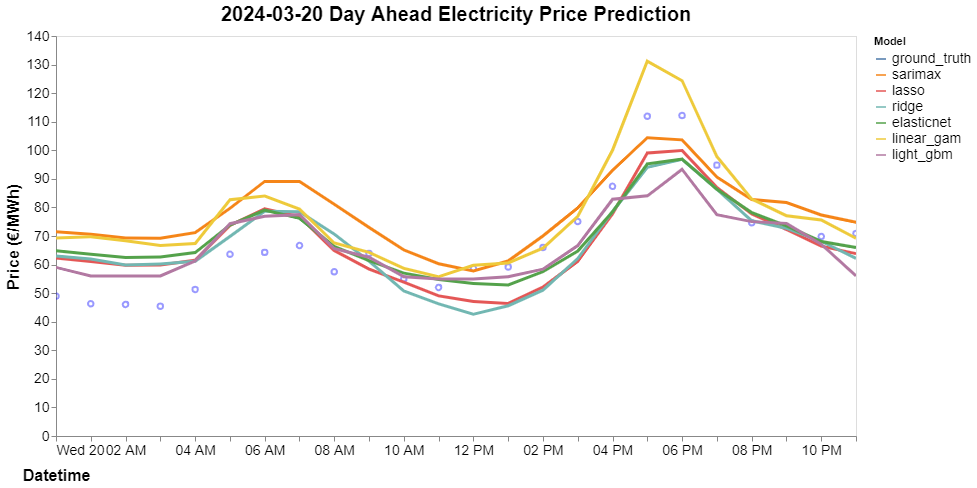

# Netherlands Electricity Price Prediction

## Motivation

European energy prices became a critical issue following their sharp increase in 2022 due to a combination of geopolitical tensions, increased demand post-COVID-19 pandemic, and supply chain disruptions. During this period, energy and supply costs surged by 110% compared to 2020 (Smal and Wieprow, 2023), forcing governments across the region to implement stimulus packages to avert a cost of living crisis. Although prices started to decline in 2023, the high inflation economic environment continues to pose a significant challenge for households.

Given the increased sensitivity to energy expenditure, there is a pressing need for households to have access to accurate energy price forecasts. These forecasts can help optimise energy consumption, potentially leading to substantial cost savings. Accurate predictions can enable consumers to make informed decisions about when to use energy-intensive appliances, thus reducing their overall expenditure.

The goal of this project is to develop a model that generates precise day-ahead energy price forecasts. By providing these forecasts through a user-friendly dashboard application, I aim to empower households to optimise their energy usage and mitigate the financial burden of fluctuating energy prices.

As a case study to demonstrate the model's accuracy, I generate forecasts for day-ahead electricity prices in the Netherlands and compare the results of the proposed method against benchmarks found in the literature. 

## Literature Review

### Qualitative Drivers of European Energy Prices (2021-2023)

From a qualitative perspective, numerous factors influenced European energy prices between 2021 and 2023. Key reasons for price increases in 2021 and 2022, as outlined by Alvarez and Molnar (2021) and Bolton (2022), include:

1. COVID-19 Pandemic:
    1. The pandemic led to a significant decline in energy demand, which resulted in reduced energy supply.
    2. During the post-pandemic economic recovery, energy demand rebounded rapidly, outpacing the slower increase in supply.
2. Increases in Natural Gas and Coal Prices:
    1. Reduced gas supply from Russia following the conflict with Ukraine and supply-side constraints limited gas imports, driving up prices.
3. Unfavourable Weather Conditions:
    1. A long, cold winter in 2021 diminished gas reserves.
    2. Heatwaves in the summer of 2022 affected hydroelectric and nuclear power generation, increasing reliance on gas for electricity.
    3. Lower-than-expected wind generation in 2022 further strained the energy supply.

Energy prices started returning closer to historical levels in 2023 and 2024. Factors influencing this reversal, as discussed by Tertre, Martinez, and Rábago (2023) and Power Engineering International (2023), include:

1. Declining Natural Gas Prices:
    1. Diversification of energy sources led to a decrease in natural gas demand.
    2. The EU reduced its dependency on Russian natural gas from over 40% to below 10% in 2023.
    3. Natural gas storage levels were built up to historic highs.
    4. Historically low energy demand in 2023 followed the previous years' price surges.
2. Increased Renewable Energy Production:
    1. Improved nuclear availability in France.
    2. High renewable generation led to negative day-ahead prices.
 
### Electricity Price Forecasting Literature 

The volatile nature of electricity prices has made their modelling a core research area in the energy sector. The literature extensively documents factors influencing electricity prices, commonly including:

1. Historical electricity prices.
2. Historical grid load.
3. Historical generation capacity.
4. Historical residual demand.
5. Historical fuel prices.
6. Day-ahead grid load forecasts.
7. Day-ahead generation capacity.
8. Temporal and calendar features: hour of day, day of week, month of year, holidays.
9. Weather features: temperature, wind speed, precipitation, etc.

In terms of methods, deep learning and machine learning are prominent for modelling short-term electricity prices. Lago, De Ridder, and De Schutter (2018) benchmarked 98 different models for forecasting spot electricity prices, showing that deep learning models, specifically deep neural networks, perform best overall. Machine learning-based methods generally outperform statistical methods. Similarly, studies by Keles, Scelle, Paraschiv, and Fichtner (2016) and Lago, Marcjasz, De Schutter, and Weron (2021) benchmarked various models for forecasting day-ahead electricity prices. Both studies concluded that deep learning models offer superior performance, though Lago et al. (2021) also highlighted the benefits of linear methods, such as competitive performance, lower computational requirements, and faster forecast generation.

Lago, De Ridder, Vrancx, and De Schutter (2018) investigated the effect of incorporating cross-market data from Belgium and France to forecast electricity prices for Belgium. They demonstrated that including French market data improved the accuracy of forecasting Belgium's electricity prices. Furthermore, they found that a dual-market forecasting model, which integrates data from both Belgium and France, can enhance predictive accuracy. This finding suggests that the features listed above should not only include local market data but also relevant data from neighbouring markets to achieve better forecasting performance.

## Data

### Data Description

The following features were selected for modelling day-ahead electricity prices in the Netherlands, based on their recognition in the literature as meaningful explanatory variables that have historically shown strong correlations with electricity prices.

**Energy Features:**
1. Day-ahead prices
2. Total load and day-ahead total load forecasts
3. Aggregated generation per type and the day-ahead forecast of the total aggregated generation
4. Unavailability of generation units
5. Day-ahead forecast of wind
6. Net physical cross-border flows
7. Total physical cross-border imports
8. Day-ahead generation forecasts for wind and solar

**Weather Features:**
1. Temperature
2. Wind speed
3. Pressure
4. Dew point
5. Humidity

**Calendar Features:**
1. Dutch holidays

Energy data was obtained from the ENTSO-E transparency platform, and comprehensive details of data items can be found in the “Detailed Data Descriptions” document by ENTSO-E (2022). Weather data were sourced from OpenWeatherMap, and Dutch holidays were retrieved using the Python package ‘holidays’.

Fuel prices, natural gas in particular, were identified as being valuable covariates for modelling electricity prices, however, such data was not freely available. A point for future work would be to include such features.

### Data Processing

 

    
    
<strong>Figure 1:</strong> Netherlands Day Ahead Electricity Prices 2020 - 2023.

 

The data preprocessing involved several key steps to prepare the dataset for modelling:

**Data Cleaning**\
The data was initially cleaned by resampling to an hourly frequency where necessary, removing duplicate entries, and eliminating features with a majority of null or zero values. Outliers were identified and removed, and missing values were interpolated to ensure a complete dataset.

**Weather Data Aggregation**\
Weather data was obtained for seven Dutch cities: Almer, Amsterdam, Eindhoven, Groningen, Rotterdam, The Hague, and Utrecht. Naturally, weather data from these cities were highly correlated. To address this, correlated features were aggregated into single weighted features by calculating weighted averages, where the weights were determined based on the electricity consumption levels retrieved from Basanisi (2020).

**Price Transformation**\
Common processing steps in forecasting financial prices, such as converting raw prices into returns and applying a log-transformation, were not used here due to the potential for zero and negative electricity prices. Although the Box-Cox transformation can handle negative values, it was not investigated in this study but could be a point for future work.

**Feature Engineering**\
Additional features were generated to better describe the target variable. Both the literature and figures 3 and 4 demonstrate day-of-week and hour-of-day seasonality, so these variables were included. Lagged features were also added to give the model more context. Optimal lags were selected by calculating the mutual information between lagged variables and the target variable, generally finding that variables lagged by one week added the most information. To provide information about the relative degree of the current time residual load compared to the residual load of the past hours, a relative load indicator (RLI) was calculated for lags of 24, 48, and 168 hours (Keles, Scelle, Paraschiv, Fichtner, 2016).

 

    
    
    
    
<strong>Figures 2 - 4:</strong> Netherlands Day Ahead Electricity by: Year and Month (2), Year and Day of Week (3), Year and Hour of Day (4).

 

**Dummy Variables for Holidays**

Dummy variables for Dutch public holidays were explored. To confirm significant differences in energy prices on holidays versus non-holidays, an A/B test was performed. The variance in electricity prices was very high from 2020-2024, which could actually be the cause for significant differences, not the holiday which is the effect being measured. To confirm that the significant differences were indeed due to the effect of the holiday, a second analysis was performed using data from 2016-2019. This secondary analysis confirmed the initial results. Consequently, dummy variables were included for all holidays except Koningsdag and Bevrijdingsdag, the latter being a public holiday only once every five years.

 

    
    
    
<strong>Tables 1 & 2:</strong> Netherlands Holiday A/B Tests: Prices 2020 - 2023 (1, Top), Prices 2016 - 2019 (2, Bottom).

 

**Data Splitting**

The dataset was divided into training, validation, and testing sets as follows:

1. Training set: A rolling window forecast method was employed, where the model was trained on data up to 48 hours before each prediction. This means the training data was continuously updated to include the most recent information available, ensuring that the model was always trained on the most relevant data.
2. Validation set: 2022-07-08 to 2023-05-11
3. Test set: 2023-05-19 to 2024-03-21

### Data Analysis

To test whether the time series are stationary, an augmented Dickey-Fuller test was performed. Most time series, except for some of the `clouds_all` features, rejected the null hypothesis of non-stationarity.

 

    
    
<strong>Figure 5:</strong> Autocorrelation Function (ACF) and Partial Autocorrelation Function (PACF) plots for Netherlands Day Ahead Electricity Prices.

 

Autocorrelation Function (ACF) and Partial Autocorrelation Function (PACF) plots of the electricity prices are shown in figure 5. The PACF plot indicates that lags in multiples of 24 are significant, demonstrating hour-of-day seasonality. This suggests that lagged price features are likely to be informative.

 

  
  
  
<strong>Figures 6 & 7:</strong> Pearson Correlation Matrices: Day Ahead Prices and Energy Features (6), Day Ahead Prices and Weather Features (7).

 

Day-ahead prices are released for the next day at 12:00 UTC. To have one full day of prices before the actual values are released, prices need to be forecasted 48 hours in advance. This is reflected in the data by generating a new leading variable `day_ahead_prices_lead_48`.

Pearson Correlation Matrices for Day Ahead Prices lead 48h with Energy Features and Weather Features are shown in figures 6 and 7, respectively. Features with the highest absolute correlation include `generation_Fossil Hard coal` (0.42), `clouds_all_amsterdam` (-0.27), `wind_speed_weighted` (0.25), and `imports` (0.23).

## Methodology

### Model Selection

As previously mentioned in the literature review, deep neural networks (DNNs) are prominent for modelling short-term electricity prices. However, these methods have some drawbacks: they take a long time to fit, they are prone to overfitting, and they are often uninterpretable.

The first drawback was a particular concern for this work, as the decision was made to forecast the target variable using a rolling method where one day's worth of price data would be forecast using the most recent data available. Using a DNN in this way would not have been viable, as it would have required over 300 separate models to be trained and tuned, which would have taken too much time with the resources available. Additionally, due to the relatively low volume of data available, there was a concern that deep learning methods would overfit. Finally, interpretability was valued in this work to identify specific drivers of day-ahead electricity prices.

Taking these concerns into account, it was decided to use generalised additive models (GAMs) and gradient boosting decision trees (GBDTs), specifically the pyGAM (Servén and Brummitt 2018) and LightGBM (Shi et al. 2024) implementations. GAMs were chosen for their interpretability and ability to model nonlinear relationships, while LightGBM was selected for its efficiency and ability to handle large datasets, addressing the limitations of DNNs like longer training times and higher risk of overfitting.

GAM (Hastie and Tibshirani, 1986) is an additive modelling technique where the impact of individual predictive variables is captured through smooth functions, which can be nonlinear (Larsen, 2015). This gives GAM more flexibility and predictive power than linear models, while retaining high interpretability through the individual relationships between predictors and the dependent variable.

GBDTs (Friedman, 2001) are among the most popular machine learning algorithms for tabular data. Several effective implementations exist, such as XGBoost and pGBRT, but their efficiency and scalability are unsatisfactory when the feature dimension is high and data size is large. LightGBM was developed to address these issues, with its creators reporting that LightGBM speeds up the training process of conventional GBDT by over 20 times while achieving almost the same accuracy (Shi et al. 2024).

The results of the GAM and LightGBM models are compared to several benchmarks: two naive forecasts, one seasonal ARIMA model, and three regularised linear models (lasso, ridge, and elastic net). The naive approaches predict the price observed in the corresponding hour 48 hours before (1) or one week before (2).

### Model Fitting

Median absolute error was chosen to compare model performance, as this metric is less sensitive to outliers compared to mean squared error. Model performance during hyperparameter optimisation was tracked and compared using Databricks MLflow, an open-source platform for managing the machine learning lifecycle. MLflow stored experiment data, facilitating the easy comparison of different models and hyperparameter configurations. The MLflow UI is shown in figure 8 below.

 

    
    
<strong>Figure 8:</strong>  Databricks MLflow UI.

 

**ARIMA**

 

    
    
<strong>Table 3:</strong>  Augmented Dickey-Fuller Test Results for Netherlands Day Ahead Electricity Prices and First Differences.

 

 

    
    
<strong>Figure 9:</strong> Autocorrelation Function (ACF) and Partial Autocorrelation Function (PACF) plots for the First Differences of Netherlands Day Ahead Electricity Prices.

 

Although the null hypothesis of the Augmented Dickey-Fuller test is rejected for day-ahead prices, the plot of the time series in figure 1 does not appear fully stationary, prompting an examination of the first difference. The significant spike at lag 1 in the PACF plot (figure 9) suggests an AR(1) component, while the spike at lag 24 indicates a seasonal AR(1) component. Similarly, the significant spike at lag 1 in the ACF plot suggests an MA(1) component, and the spike at lag 24 indicates a seasonal MA(1) component. These observations suggest that a SARIMAX(1, 1, 1)x(1, 0, 1, 24) model is appropriate.

 

    
    
<strong>Figure 10:</strong> Model Fit Summary from auto_arima.

 

A model was also fitted using pmdarima.auto_arima to confirm these parameter selections, and the results are shown in figure 10 above. Due to the time required to fit the auto_arima function, only the last 200 observations in the training set were used. The best model identified by auto_arima was SARIMAX(1, 0, 1)x(1, 0, 1, 24). Both models will be fitted and their performance compared on the validation set, and the SARIMAX(1, 2, 1)x(1, 0, 1, 24) model using 200 days produced the best fit.

**Regularised Linear Models**

 

    
    
<strong>Table 4:</strong>  Linear Models' Optimal Hyperparamter Settings.

 

 

    
    
    
    
<strong>Figures 11 - 13:</strong> Coefficient Values: Lasso (11), Ridge (12), Elastic Net (13).

 

Hyperparameters for the regularised linear models (lasso, ridge, and elastic net) were selected to minimise validation MAE while avoiding overfitting, with the optimal parameters shown in table 4 above. The fitted coefficient values for these models are displayed in figures 11-13 above. Sparsity is introduced by the Lasso and Elastic Net models, as both have only 11 and 10 non-zero coefficients, respectively. In contrast, the Ridge model has significantly more non-zero coefficients, making it more complex than the Lasso and Elastic Net models. This complexity is also reflected in its optimal alpha value, which is several orders of magnitude greater than the optimal alpha values for the simpler Lasso and Elastic Net models.

**GAM**

 

    
    
<strong>Figure 14:</strong> Linear GAM Partial Dependance Plots.

 

Insignificant features indicated by the p-values reported in the model summary were removed, and regularisation penalties were optimised using grid search. The contribution of each feature to the overall prediction in a GAM model can be inspected using partial dependence functions, as presented in figure 14. Many of the relationships are intuitive, such as positive relationships with `day_ahead_prices`, `generation_Fossil Gas`, `generation_Other`, `Forecasted Load`, and `generation_fossil_gas_missing_qty`, and negative relationships with `generation_Solar`, `generation_forecast`, `residual_load`, `humidity_weighted`, `wind_speed_weighted`, and `generation_fossil_hard_coal_missing_qty`.

The relationships of the categorical features with the target are also intuitive. The `target_day_of_week` plot shows that prices peak at the start of the week and are lowest on the weekend. The `target_weekend` plot confirms that prices are higher during the week than on the weekend. The `target_hour_of_day` plot shows that prices peak at approximately 7 am and 7 pm, which aligns with observations in figures 3 and 4.

However, several non-linear relationships are non-intuitive, such as those for `generation_Biomass`, `generation_Fossil Hard coal`, `generation_Nuclear`, `generation_Waste`, and `generation_forecast_Wind`. These may indicate that these features are not as informative.

**Light GBM**

 

    
    
<strong>Table 5:</strong>  Light GBM Optimal Parameter Values.

 

 

    
    
<strong>Figure 15:</strong> Light GBM Feature Importances.

 

Noise parameters were added to the predictor variables, and features with importances less than these values were removed. Given the large number of hyperparameters to tune with LightGBM, the Bayesian optimisation package Hyperopt (Bergstra et al., 2013), which systematically searched the parameter space to find the optimal configuration that minimized validation error, as shown in table 5. Feature importances for the model are displayed in figure 15.

## Results

 

    
    
<strong>Figure 16:</strong> Plot of Forecasts for a Single Day (20/03/2024) in the Test Period.

 

 

    
    
<strong>Table 6:</strong> Performance Comparison between Fitted Models.

 

The results of the GAM and LightGBM models are compared to several benchmarks: two naive forecasts, one seasonal ARIMA model, and three regularised linear models (lasso, ridge, and elastic net). The naive approaches predict the price observed in the corresponding hour 48 hours before (naive_minus_2_days) or one week before (naive_minus_7_days). Figure 16 demonstrates the model's predictive accuracy for a specific day, highlighting how closely the forecasted prices align with the actual prices.

The naive models were able to describe a considerable amount of variation in the training and validation data, with the naive_minus_2_days and naive_minus_7_days models producing \( R^2 \) values of 0.62 and 0.57, respectively. This indicates strong seasonality in the data during this period. However, the seasonal feature of the data is weaker in the test data, as the \( R^2 \) values considerably worsened to -0.11 and 0.05 for the naive_minus_2_days and naive_minus_7_days models, respectively. The test MAE values for these models are lower compared to the validation MAE values, with test MAE of 29.73 and 27.94 vs. validation MAE of 60.47 and 68.53 for naive_minus_2_days and naive_minus_7_days, respectively. This suggests that day-ahead prices were more volatile during the validation period compared to the test period.

The Seasonal ARIMA model outperformed the naive models on the validation data, with a validation MAE of 58.19 and an \( R^2 \) of 0.68. However, its test performance was worse than the naive models, with a test MAE of 30.43 and \( R^2 \) of 0.0. Like the naive models, Seasonal ARIMA considers the seasonality of electricity prices, but its test performance is significantly worse than its validation performance. The poor performance of Seasonal ARIMA on the test data suggests that incorporating informative exogenous variables related to energy prices may be necessary to surpass the naive benchmarks.

The linear models improved on the naive models, with Ridge producing the lowest test MAE of 22.91 and \( R^2 \) of 0.41. It is notable that the \( R^2 \) value for the Ridge model significantly decreased between the validation and test sets, from 0.69 to 0.41. While the lower training MAE compared to the validation MAE for Ridge suggests potential overfitting, this likely reflects a difference in price volatility between the periods, as also observed for the naive models. Despite the worsening MAE between the training and validation sets, the consistent \( R^2 \) values suggest the model did not overfit. This, along with observations from the naive results, indicates that prices during the testing period were less predictable than during the validation period.

The GAM model also improved on the naive models, but only slightly, with a test MAE of 27.86 and an  \( R^2 \) of 0.13. This is surprising, as GAM typically performs better than linear models by capturing more complex relationships between covariates and the target variable. On the validation data, the GAM model achieved a MAE of 58.14 and an  \( R^2 \) of 0.72, which is similar to the Linear model’s validation performance. However, large smoothing parameter values were required to avoid overfitting, which resulted in less flexible and smoother learned relationships. These relationships, visualised in figure 14, suggest that the large smoothing parameters forced the model to approximate linear relationships. Significant features identified by the GAM model include `day_ahead_prices`, `generation_solar`, `wind_speed_weighted`, `generation_forecast`, and `generation_Other`. The limited flexibility imposed by the smoothing parameters likely explains why the GAM model performed similarly to the linear models on the validation data.

LightGBM produced the best test results among all models examined. However, the test performance was muted compared to its validation performance. LightGBM's validation MAE of 41.36 was a 27% improvement over the next best linear model (57.09 for ridge), while its test MAE of 21.47 was only a 6% improvement over the next best linear model (22.91 for lasso). Similarly, LightGBM's validation \( R^2 \) of 0.83 was significantly higher than the next best linear model (0.72 for ridge), whereas its test \( R^2 \) of 0.44 was only marginally higher than the next best linear model (0.41 for lasso).

The monthly total absolute error per model for the validation and test sets is shown in Figures 17 and 18. These plots illustrate the variation in the magnitude of energy prices during the observed periods. For the validation set, the maximum monthly total absolute error exceeds €80,000, whereas, for the test set, the maximum value is under €35,000. Notably, the highest total errors occur in August 2022, coinciding with peak energy prices shown in Figure 1. Errors generally decline throughout the remainder of the validation and test sets, mirroring the decline in energy prices during the same period.

When comparing model performance in these plots, it is evident that the LightGBM model significantly outperforms the other models for the validation data, especially in months with high total errors. As the total error decreases in the validation and test sets, LightGBM's advantage diminishes. This could be due to the parameters being overly optimized for the validation set, or it might indicate that the benefits of using a more powerful model like LightGBM are more pronounced when dealing with more volatile data.

The results highlight the importance of model selection based on the volatility characteristics of the data. LightGBM outperformed other models during periods of high volatility but showed diminished advantages when volatility decreased. This underscores the need for models that can adapt to varying data characteristics. The strong seasonality and volatility in the data affect model performance, indicating that future work should explore more sophisticated techniques to handle these factors and further improve predictive accuracy.

 

    
    
    
<strong>Figures 17 & 18:</strong> Total Absolute Error: Validation Set (17), Test Set (18).

 

## Improvement in Energy Cost Estimation

By utilising the advanced model to predict day-ahead energy prices, households can significantly improve the accuracy of their energy cost estimates compared to using a naive prediction method (price lagged by 7 days). This improvement translates into tangible benefits for budgeting and financial planning.

The average household electricity consumption data was obtained from the "SmartMeter Energy Consumption Data in London Household" dataset, available [here](https://data.london.gov.uk/dataset/smartmeter-energy-use-data-in-london-households). The dataset was used to calculate the average electricity consumption per household by month, day, and hour. The energy costs were calculated by multiplying the average household electricity consumption by the corresponding prices (ground truth, naive predictions, and model predictions) for the testing period of 308 days. The absolute error between the ground truth costs and the costs calculated using the naive and model predictions was computed.

- **Ground Truth Cost**: €472.00 (€559.35 annualised)
- **Naive Cost Absolute Error**: €157.49
- **Model Cost Absolute Error**: €120.12
- **Improvement in Prediction Accuracy**: (€157.49 - €120.12) / €157.49 = 23.72%

The annualized ground truth cost was €559.35. By reducing the absolute error by €37.37 compared to the naive method, the model achieves an annualized savings of €44.29, which is 7.91% of the actual annual energy cost.

Households can benefit from more accurate energy cost estimations, leading to better budgeting and potentially significant annual savings. The advanced model reduces prediction errors by 23.72%, translating into an estimated annual cost improvement of €44.29 per household. This improvement accounts for 7.91% of the actual annual energy cost, allowing households to manage their energy expenses more effectively and reduce financial strain. This demonstrates the practical value of the model in helping households optimise their energy usage and budget more effectively.

## System Design

The goal of this project was to develop a model that generates precise day-ahead energy price forecasts and to serve these forecasts to users through a user-friendly dashboard application. To achieve this, the project was divided into two main components: the frontend and the backend.

For the frontend, [Streamlit](https://streamlit.io/) was chosen due to its simplicity and rapid development capabilities. This web-based interface allows users to input parameters and view forecasts seamlessly. On the backend, FastAPI (Ramírez) was selected for its high performance and ease of integration with machine learning models, enabling efficient processing of requests and model predictions.

Given the prototype nature of the project, a sophisticated method for data storage and retrieval was not implemented. Instead, predictions were generated offline and included as a pandas DataFrame within the Docker container. This approach ensured that all necessary prediction data was readily available for the frontend to access and display, maintaining simplicity while providing the required functionality. Although straightforward, this data handling method was effective for the prototype stage, ensuring that the necessary data was always available for the application to function correctly.

Both the frontend and backend were containerised using Docker to ensure consistency and ease of deployment. The prototype application was deployed to [DigitalOcean](https://www.digitalocean.com/), a cloud platform that offers scalable and reliable infrastructure.

While user authentication and security were not a primary focus for this prototype, the core functionality of the forecasting model and user interface was successfully demonstrated. The system was designed to highlight the practical application of day-ahead energy price forecasting, showcasing both the technical and user interaction aspects of the project.

Future enhancements could include implementing a database for dynamic data storage, incorporating real-time data updates, and enhancing user authentication and security features.

A demonstration of the dashboard application is shown in figure 19 below.

 

    
    
<strong>Figure 19:</strong> Demonstration of the Application's User Experience.

 

## Conclusion

This project successfully developed a model for precise day-ahead energy price forecasts, demonstrating improved predictive performance and significant potential for household savings.

As a case study, forecasts were generated for electricity prices in the Netherlands. Data was retrieved from the ENTSO-E transparency platform and extensively cleaned and preprocessed. Feature engineering, guided by insights from energy price forecasting literature, was performed to enhance model accuracy.

A LightGBM model was developed, outperforming benchmarks found in the literature. These forecasts were visualized in a user-friendly dashboard application, deployed using Docker and hosted on DigitalOcean. The practical value of the model was demonstrated by accurately predicting household electricity costs, which leads to better budgeting and potentially significant annual savings. Specifically, the advanced model reduces prediction errors by 23.72%, translating into an estimated annual cost improvement of €44.29 per household. This improvement accounts for 7.91% of the actual annual energy cost, enabling households to manage their energy expenses more effectively and reduce financial strain.

Future research should focus on incorporating additional covariates, such as real-time fuel prices, and developing more sophisticated models to handle temporal variability. This could include advanced time series techniques, integration of cross-market data, and machine learning methods designed to adapt to changing market conditions, further enhancing predictive accuracy and reliability.

## References

## References

Alvarez, C.F. and Molnar, G., 2021. What is behind soaring energy prices and what happens next?

Basanisi, L., 2020. Energy consumption of the Netherlands. Available at: <https://www.kaggle.com/datasets/lucabasa/dutch-energy> [Accessed 29 March 2024].

Bergstra, J., Yamins, D. and Cox, D.D., 2013. Making a Science of Model Search: Hyperparameter Optimization in Hundreds of Dimensions for Vision Architectures. In: Proceedings of the 30th International Conference on Machine Learning (ICML 2013), June 2013. pp.115-123.

Bolton, R., 2022. Natural gas, rising prices and the electricity market.

ENTSO-E, 2022. Detailed Data Descriptions, Version 3, Release 3. Available at: <https://transparency.entsoe.eu/> [Accessed 1 March 2024].

ENTSO-E transparency platform. Available at: <https://transparency.entsoe.eu/> [Accessed 1 March 2024].

Friedman, J.H., 2001. Greedy function approximation: a gradient boosting machine. Annals of Statistics, pp.1189-1232.

Greater London Authority, 2023. SmartMeter Energy Consumption Data in London Households. [online] Available at: <https://data.london.gov.uk/dataset/smartmeter-energy-use-data-in-london-households> [Accessed 1 July 2024].

Hastie, T. and Tibshirani, R., 1986. Generalized Additive Models. Statistical Science, 1(3), pp.297-310.

holidays, 2024. holidays 0.50. Available at: <https://pypi.org/project/holidays/> [Accessed 1 March 2024].

Keles, D., Scelle, J., Paraschiv, F. and Fichtner, W., 2016. Extended forecast methods for day-ahead electricity spot prices applying artificial neural networks. Applied Energy, 162, pp.218-230.

Lago, J., De Ridder, F. and De Schutter, B., 2018. Forecasting spot electricity prices: Deep learning approaches and empirical comparison of traditional algorithms. Applied Energy, 221, pp.386-405.

Lago, J., De Ridder, F., Vrancx, P. and De Schutter, B., 2018. Forecasting day-ahead electricity prices in Europe: The importance of considering market integration. Applied Energy, 211, pp.890-903.

Lago, J., Marcjasz, G., De Schutter, B. and Weron, R., 2021. Forecasting day-ahead electricity prices: A review of state-of-the-art algorithms, best practices and an open-access benchmark. Applied Energy, 293, p.116983.

Larsen, K., 2015. GAM: The Predictive Modeling Silver Bullet. Available at: <https://multithreaded.stitchfix.com/blog/2015/07/30/gam/> [Accessed 10 June 2024].

OpenWeather, 2024. Available at: <https://openweathermap.org/> [Accessed 1 March 2024].

pmdarima, 2024. pmdarima 2.0.4. Available at: <https://pypi.org/project/pmdarima/> [Accessed 1 March 2024].

Power Engineering International, 2023. Record low European power demand in Q2 as renewables output hits new high. Power Engineering International. Available at: <https://www.powerengineeringint.com/world-regions/europe/record-low-european-power-demand-in-q2-as-renewables-output-hits-new-high/> [Accessed 1 June 2024].

Ramírez, S., 2024. FastAPI. [Computer software] Available at: <https://github.com/tiangolo/fastapi>.

Servén, D. and Brummitt, C., 2018. pyGAM: Generalized Additive Models in Python. Zenodo. DOI: 10.5281/zenodo.1208723.

Shi, Y., Ke, G., Soukhavong, D., Lamb, J., Meng, Q., Finley, T., Wang, T., Chen, W., Ma, W., Ye, Q., Liu, T., Titov, N. and Cortes, D., 2024. lightgbm: Light Gradient Boosting Machine. R package version 4.3.0.99. Available at: <https://github.com/Microsoft/LightGBM>.

Smal, T. and Wieprow, J., 2023. Energy security in the context of global energy crisis: economic and financial conditions. Energies, 16(4), p.1605.

Tertre, M.G., Martinez, I. and Rábago, M.R., 2023. Reasons behind the 2022 energy price increases and prospects for next year.