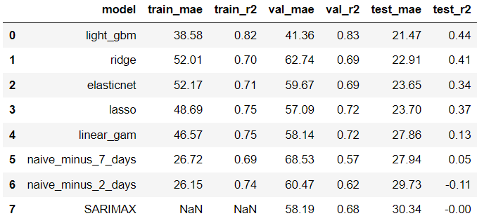

# Netherlands Electricity Price Prediction

## Executive Summary

### Project Motivation

The sharp increase in European energy prices in 2022, driven by geopolitical tensions, post-COVID-19 demand surge, and supply chain disruptions, highlighted the urgent need for accurate energy price forecasts. These forecasts can help households optimize energy usage and mitigate financial strain. This project aims to develop a model that generates precise day-ahead energy price forecasts, presented through a user-friendly dashboard application. As a case study, forecasts were generated for day-ahead electricity prices in the Netherlands and compared against benchmarks found in the literature.

### Data and Features

Data was sourced from the ENTSO-E transparency platform and OpenWeatherMap, covering energy prices, total load, generation capacity, cross-border flows, and weather variables such as temperature, wind speed, and humidity. Additionally, Dutch public holidays were included as calendar features. Comprehensive data cleaning and feature engineering steps were undertaken to prepare the dataset for modeling.

### Methodology

Various models were explored for forecasting day-ahead electricity prices, including:

1. **Naive Forecasts**: Using prices from 48 hours and one week prior.
2. **Seasonal ARIMA Models**: Incorporating seasonality and autocorrelation factors.
3. **Regularised Linear Models**: Lasso, Ridge, and Elastic Net to handle multicollinearity and feature selection.
4. **Generalised Additive Models (GAMs)**: Capturing smooth, non-linear relationships between features and the target variable.
5. **Gradient Boosting Decision Trees (GBDTs)**: LightGBM for efficient and scalable modeling.

### Results

    
    
<strong>Figure 1:</strong> Plot of Forecasts for a Single Day (20/03/2024) in the Test Period.

    
    
<strong>Table 1:</strong> Performance Comparison between Fitted Models.

- **Naive Models**: Demonstrated strong seasonality in the training and validation data but performed poorly on the test data.
- **Seasonal ARIMA Models**: Outperformed naive models on validation data but failed to generalize well to the test data, indicating the need for exogenous variables.
- **Regularised Linear Models**: Improved on naive models, with Ridge achieving the lowest test MAE of 22.91 and an \( R^2 \) of 0.41.
- **GAM**: Showed modest improvement over naive models but required large smoothing parameters, resulting in linear-like relationships.
- **LightGBM**: Achieved the best test results among all models, though the performance difference between validation and test data highlighted challenges in handling data volatility and seasonality.

### System Design

The project employed Streamlit for the frontend interface and FastAPI for the backend, facilitating user interaction and efficient processing of model predictions. Docker was used to containerize both frontend and backend, ensuring consistency and ease of deployment. The prototype application was deployed on DigitalOcean.

### Conclusion and Future Work

The developed model successfully generated precise day-ahead electricity price forecasts for the Netherlands, outperforming benchmarks in the literature. Future work will focus on incorporating additional covariates, such as fuel prices, and exploring sophisticated techniques to handle temporal variability in seasonality and volatility to further enhance predictive accuracy.

### Demonstration

    
    
<strong>Figure 2:</strong> Demonstration of the Application's User Experience.

### Further Reading

For more detailed information, please refer to the full documentation and references used in this project, available in the repository [here](https://github.com/seamusokeeffe/electricity_price_forcasting/blob/master/Documentation.md).
